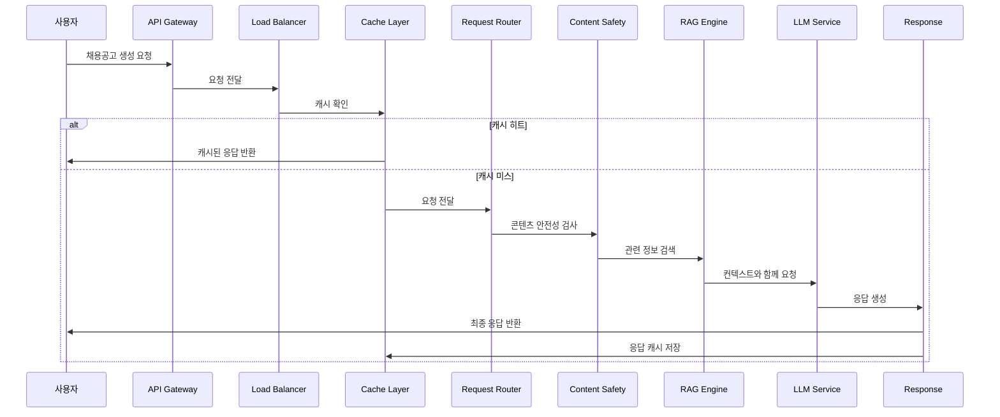

# 과제 2: GenAI 서비스 시스템 아키텍처 설계

## 전체 시스템 아키텍처

### 시스템 개요

잡코리아 GenAI 채용공고 생성 서비스는 두 가지 주요 이슈(부정확한 응답, 응답 지연)를 해결하기 위한 고성능, 고신뢰성 시스템으로 설계되었습니다.

```
┌─────────────────────────────────────────────────────────────────────────────┐
│                              사용자 인터페이스                                │
│  ┌─────────────────┐  ┌─────────────────┐  ┌─────────────────────────────┐ │
│  │   웹 애플리케이션  │  │   모바일 앱     │  │      API 클라이언트        │ │
│  └─────────────────┘  └─────────────────┘  └─────────────────────────────┘ │
└─────────────────────────────────────────────────────────────────────────────┘
                                        │
                                        ▼
┌─────────────────────────────────────────────────────────────────────────────┐
│                              API Gateway Layer                             │
│  ┌─────────────────┐  ┌─────────────────┐  ┌─────────────────────────────┐ │
│  │   인증/인가      │  │   Rate Limiting │  │      요청 라우팅           │ │
│  └─────────────────┘  └─────────────────┘  └─────────────────────────────┘ │
└─────────────────────────────────────────────────────────────────────────────┘
                                        │
                                        ▼
┌─────────────────────────────────────────────────────────────────────────────┐
│                              Load Balancer                                 │
│  ┌─────────────────┐  ┌─────────────────┐  ┌─────────────────────────────┐ │
│  │   지리적 분산    │  │   동적 스케일링  │  │      헬스 체크             │ │
│  └─────────────────┘  └─────────────────┘  └─────────────────────────────┘ │
└─────────────────────────────────────────────────────────────────────────────┘
                                        │
                                        ▼
┌─────────────────────────────────────────────────────────────────────────────┐
│                              Cache Layer                                   │
│  ┌─────────────────┐  ┌─────────────────┐  ┌─────────────────────────────┐ │
│  │   응답 캐시      │  │   세션 캐시     │  │      사용자 설정 캐시       │ │
│  │   (Redis)       │  │   (Local Cache) │  │      (Memory)               │ │
│  └─────────────────┘  └─────────────────┘  └─────────────────────────────┘ │
└─────────────────────────────────────────────────────────────────────────────┘
                                        │
                                        ▼
┌─────────────────────────────────────────────────────────────────────────────┐
│                              Request Router                                │
│  ┌─────────────────┐  ┌─────────────────┐  ┌─────────────────────────────┐ │
│  │   요청 분석      │  │   복잡도 평가    │  │      처리 경로 선택         │ │
│  └─────────────────┘  └─────────────────┘  └─────────────────────────────┘ │
└─────────────────────────────────────────────────────────────────────────────┘
                                        │
                                        ▼
┌─────────────────────────────────────────────────────────────────────────────┐
│                              Core Services                                 │
│  ┌─────────────────┐  ┌─────────────────┐  ┌─────────────────────────────┐ │
│  │   Content Safety│  │   RAG Engine    │  │      LLM Orchestrator      │ │
│  │   Filter        │  │   (Vector DB)   │  │      (Model Selection)     │ │
│  └─────────────────┘  └─────────────────┘  └─────────────────────────────┘ │
└─────────────────────────────────────────────────────────────────────────────┘
                                        │
                                        ▼
┌─────────────────────────────────────────────────────────────────────────────┐
│                              LLM Services                                 │
│  ┌─────────────────┐  ┌─────────────────┐  ┌─────────────────────────────┐ │
│  │   Fast Model    │  │   Quality Model │  │      Specialized Model     │ │
│  │   (GPT-3.5)     │  │   (GPT-4)       │  │      (Claude-3)           │ │
│  └─────────────────┘  └─────────────────┘  └─────────────────────────────┘ │
└─────────────────────────────────────────────────────────────────────────────┘
                                        │
                                        ▼
┌─────────────────────────────────────────────────────────────────────────────┐
│                              Response Layer                                │
│  ┌─────────────────┐  ┌─────────────────┐  ┌─────────────────────────────┐ │
│  │   Fact Checker  │  │   Response      │  │      Streaming Response    │ │
│  │   (Validation)  │  │   Aggregator    │  │      (Real-time)           │ │
│  └─────────────────┘  └─────────────────┘  └─────────────────────────────┘ │
└─────────────────────────────────────────────────────────────────────────────┘
                                        │
                                        ▼
┌─────────────────────────────────────────────────────────────────────────────┐
│                              Monitoring                                    │
│  ┌─────────────────┐  ┌─────────────────┐  ┌─────────────────────────────┐ │
│  │   성능 모니터링  │  │   오류 추적     │  │      사용자 행동 분석       │ │
│  │   (Logging)     │  │   (Error Log)   │  │      (Basic Analytics)     │ │
│  └─────────────────┘  └─────────────────┘  └─────────────────────────────┘ │
└─────────────────────────────────────────────────────────────────────────────┘
```

## 상세 처리 Flow

### 1. 사용자 요청 처리 Flow


    participant FC as Fact Checker
    participant R as Response

    U->>AG: 채용공고 생성 요청
    AG->>AG: 인증/인가 확인
    AG->>LB: 요청 전달
    LB->>C: 캐시 확인

    alt 캐시 히트
        C->>R: 캐시된 응답 반환
        R->>U: 즉시 응답
    else 캐시 미스
        C->>RR: 요청 전달
        RR->>RR: 요청 복잡도 분석
        RR->>CS: Content Safety 검사
        CS->>RAG: 관련 정보 검색
        RAG->>LLM: 컨텍스트와 함께 요청
        LLM->>FC: 생성된 응답 검증
        FC->>R: 검증된 응답
        R->>C: 응답 캐싱
        R->>U: 최종 응답
    end
```

### 2. 이슈 해결 Flow

#### 2.1 부정확한 응답 해결 Flow

```
사용자 요청 → 기업 정보 검증 → RAG로 관련 데이터 검색 →
프롬프트 엔지니어링 → LLM 생성 → Fact Checker 검증 →
Content Safety Filter → 최종 응답
```

#### 2.2 응답 지연 해결 Flow

```
요청 분석 → 복잡도 평가 → 적절한 모델 선택 →
캐시 확인 → 스트리밍 응답 시작 → 백그라운드 완성 →
실시간 업데이트
```

## 핵심 컴포넌트 상세 설계

### 1. Request Router

```python
class RequestRouter:
    def __init__(self):
        self.complexity_analyzer = ComplexityAnalyzer()
        self.model_selector = ModelSelector()
        self.cache_manager = CacheManager()

    def route_request(self, request):
        # 요청 복잡도 분석
        complexity = self.complexity_analyzer.analyze(request)

        # 적절한 처리 경로 선택
        if complexity == "SIMPLE":
            return self.handle_simple_request(request)
        elif complexity == "MEDIUM":
            return self.handle_medium_request(request)
        else:  # COMPLEX
            return self.handle_complex_request(request)

    def handle_simple_request(self, request):
        # 경량 모델로 빠른 응답
        return self.fast_model_service.process(request)

    def handle_complex_request(self, request):
        # 고성능 모델로 정확한 응답
        return self.quality_model_service.process(request)
```

### 2. Content Safety Filter

```python
class ContentSafetyFilter:
    def __init__(self):
        self.bias_detector = BiasDetector()
        self.sensitive_info_detector = SensitiveInfoDetector()
        self.inappropriate_content_detector = InappropriateContentDetector()

    def filter_content(self, content):
        # 편향성 검사
        bias_score = self.bias_detector.detect(content)

        # 민감 정보 검사
        sensitive_score = self.sensitive_info_detector.detect(content)

        # 부적절한 내용 검사
        inappropriate_score = self.inappropriate_content_detector.detect(content)

        # 종합 위험도 계산
        total_risk = self.calculate_total_risk(bias_score, sensitive_score, inappropriate_score)

        if total_risk > THRESHOLD:
            return self.sanitize_content(content)

        return content
```

### 3. RAG Engine

```python
class RAGEngine:
    def __init__(self):
        self.vector_db = VectorDatabase()
        self.embedding_model = EmbeddingModel()
        self.retriever = Retriever()

    def retrieve_relevant_info(self, query, company_info):
        # 쿼리 임베딩
        query_embedding = self.embedding_model.embed(query)

        # 관련 정보 검색
        relevant_docs = self.retriever.search(
            query_embedding,
            company_info,
            top_k=5
        )

        # 컨텍스트 구성
        context = self.build_context(relevant_docs)

        return context
```

### 4. LLM Orchestrator

```python
class LLMOrchestrator:
    def __init__(self):
        self.fast_model = FastLLMService()
        self.quality_model = QualityLLMService()
        self.specialized_model = SpecializedLLMService()

    def select_model(self, request_complexity, user_preference):
        if request_complexity == "SIMPLE":
            return self.fast_model
        elif request_complexity == "COMPLEX":
            return self.quality_model
        else:
            return self.specialized_model

    def process_request(self, request, context):
        model = self.select_model(request.complexity, request.user_preference)

        # 스트리밍 응답 시작
        response_stream = model.generate_stream(request, context)

        return response_stream
```

## 목표 성능 지표 및 모니터링

### 1. 핵심 성능 지표 (KPI)

- **응답 시간**: P50 < 1초, P95 < 3초, P99 < 5초
- **정확도**: 95% 이상의 정확한 정보 생성
- **처리량**: 초당 1000+ 요청 처리
- **가용성**: 99.9% 이상의 서비스 가용성
- **사용자 만족도**: 4.5/5.0 이상

### 2. 모니터링 대시보드

```python
class PerformanceMonitor:
    def __init__(self):
        self.metrics_collector = MetricsCollector()
        self.alert_manager = AlertManager()

    def collect_metrics(self):
        # 응답 시간 메트릭
        response_time = self.metrics_collector.get_response_time()

        # 처리량 메트릭
        throughput = self.metrics_collector.get_throughput()

        # 오류율 메트릭
        error_rate = self.metrics_collector.get_error_rate()

        # 리소스 사용률
        resource_usage = self.metrics_collector.get_resource_usage()

        return {
            'response_time': response_time,
            'throughput': throughput,
            'error_rate': error_rate,
            'resource_usage': resource_usage
        }

    def check_alerts(self, metrics):
        if metrics['response_time'] > THRESHOLD:
            self.alert_manager.send_alert("응답 시간 초과")

        if metrics['error_rate'] > ERROR_THRESHOLD:
            self.alert_manager.send_alert("오류율 증가")
```

## 배포 및 운영 전략

### 1. 배포 아키텍처

```
Production Environment
├── Primary Region (Seoul)
│   ├── API Gateway Cluster
│   ├── Load Balancer Cluster
│   ├── Application Cluster
│   └── Database Cluster
└── Secondary Region (Tokyo)
    ├── Disaster Recovery
    └── Geographic Load Balancing
```

### 2. CI/CD Pipeline

```yaml
# .github/workflows/deploy.yml
name: Deploy to Production
on:
  push:
    branches: [main]

jobs:
  deploy:
    runs-on: ubuntu-latest
    steps:
      - uses: actions/checkout@v2
      - name: Run Tests
        run: |
          npm install
          npm test
      - name: Build Application
        run: npm run build
      - name: Deploy to Production
        run: |
          # 배포 스크립트 실행
          ./deploy.sh production
```

### 3. 롤백 전략

- **Blue-Green Deployment**: 무중단 배포 및 즉시 롤백
- **Canary Deployment**: 점진적 배포로 위험 최소화
- **Feature Flags**: 기능별 활성화/비활성화 제어

## 비용 최적화

### 1. 리소스 사용량 최적화

- **Auto-scaling**: 트래픽에 따른 자동 리소스 조정
- **Spot Instances**: 비용 효율적인 인스턴스 활용
- **Reserved Instances**: 장기 사용 시 할인 혜택

### 2. API 호출 비용 최적화

- **캐싱 전략**: 중복 요청 최소화
- **배치 처리**: 여러 요청을 묶어서 처리
- **모델 선택**: 요청 복잡도에 따른 적절한 모델 선택

## 보안 및 규정 준수

### 1. 데이터 보안

- **암호화**: 전송 중 및 저장 시 데이터 암호화
- **접근 제어**: 역할 기반 접근 제어 (RBAC)
- **감사 로그**: 모든 접근 및 변경 사항 기록

### 2. 규정 준수

- **GDPR**: 개인정보 보호 규정 준수
- **한국 개인정보보호법**: 국내 법규 준수
- **SOC 2**: 보안 및 가용성 인증

이 설계는 잡코리아 GenAI 서비스의 두 가지 주요 이슈를 체계적으로 해결하며, 확장 가능하고 안정적인 시스템을 제공할 수 있다고 봅니다.
